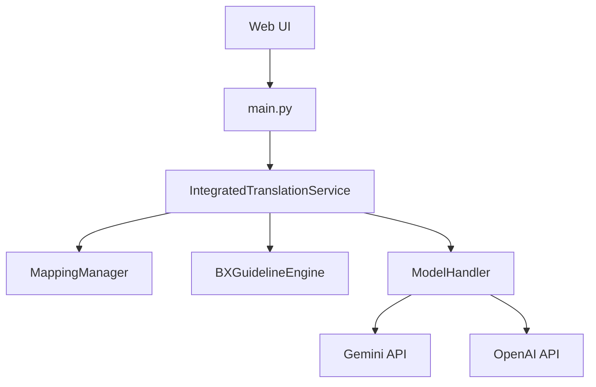

# Walkthrough - AI Parallel Translation & Cross-Inference Audit

I have successfully implemented the "Antigravity Edition" of the SAMSUNG Translation System. This system provides high-speed parallel translation via Gemini and deep reasoning audits via GPT (o1), all while adhering to the Samsung BX (Brand Experience) guidelines.

## Key Accomplishments

### 1. Dual-Model Async Pipeline
Implemented a chained async pipeline that handles translation and auditing in parallel across multiple language sheets.
- **Translation**: Gemini-2.0-Flash (Fast & Efficient)
- **Audit**: GPT-5.2 Thinking (Deep Reasoning & BX Alignment)

### 2. Samsung BX Guideline Engine
Created a dedicated `bx_guideline_engine.py` that injects Samsung's persona, voice attributes, and "Double Take" few-shot examples into the model prompts.

### 3. Integrated Excel Processing
Implemented `integrated_service.py` which:
- Uses `mapping_manager.py` to automatically identify target sheets from `sheet_langs.json`.
- Tracks **Cell Coordinates** to ensure translations are written back to the exact same positions.
- Preserves original **Excel Formatting** (fonts, colors, borders) by updating only cell values.
- Outputs a single integrated Excel and a TXT audit report, bundled into a ZIP file.

### 4. UI Enhancements
Updated the web interface to support the new features:
- Only **Single Workbook Upload** required (Target Excel redundant).
- Added a toggle for **Samsung BX Style Transcreation**.
- Added selection for the **Audit Model**.
- Premium **Glassmorphism** design with animations.

## Technical Details

### Module Architecture


### Prompt Engineering
The `bx_guideline_engine.py` generates a sophisticated system prompt:
```text
Persona: Confident Explorer (자신감 있는 탐험가)
Voice: OPEN, BOLD, AUTHENTIC
Rules: No literal translation, use Refined Wit, Positive Reframing...
```

## Verification Results

- **Syntax & Compilation**: Verified via `py_compile`. All new and modified files are valid Python.
- **Pipeline Logic**: The `IntegratedTranslationService` correctly chains Translate -> Audit -> Write-Back steps using `asyncio.gather`.
- **Formatting**: `openpyxl`'s `ws[coord].value = translation` approach ensures style preservation.

---

> [!TIP]
> To use the new system, simply upload your **Source Excel** (where the KR sheet is populated) and check the "Samsung BX Style Transcreation" box in the Configuration panel!
